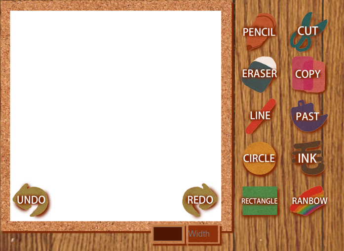
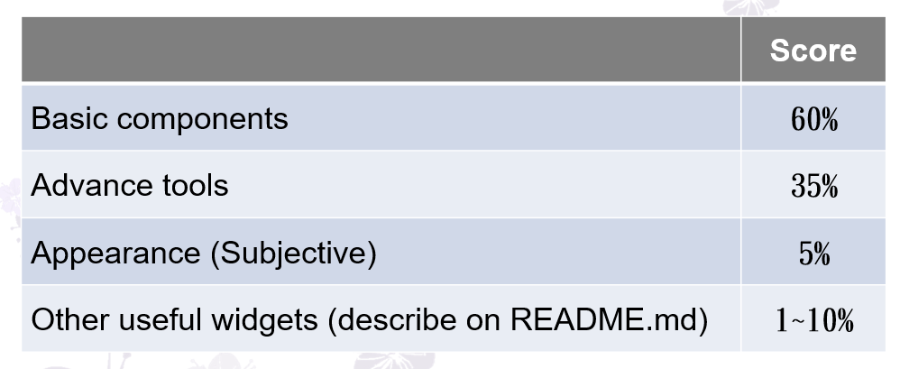

# Software Studio 2018 Spring AS01 Web Canvas

## Web Canvas
</img>

## Todo
1. **Fork this repo to your account, remove fork relationship and change project visibility to public.**
1. Create your own web page with HTML5 canvas element that we can draw or editing on it.
2. Beautify appearance by CSS.
3. Design user interaction widgets and control tools for custom setting or editing (JavaScript).
4. **Commit to "your" project repository and deploy to Gitlab page.**

## Scoring
**Check detail requirments via iLMS [2018(Spring)_SS-Assignment_01. Web Canvas.pdf ]**
</img>

* ## Reminder
    * Do not make any change to our root project repository.
    * Deploy your web page to Gitlab page, and ensure it works correctly.
        * Your main page should be named as "index.html"
    * You should also upload all source code to iLMS.
        * .html or .htm, .css, .js, etc.
        * source files
    * Deadline: 2018/04/05 23:59 (commit time)
        * Delay will get 0 point (no reason)
        * Copy will get 0 point
        * "屍體" and 404 is not allowed

