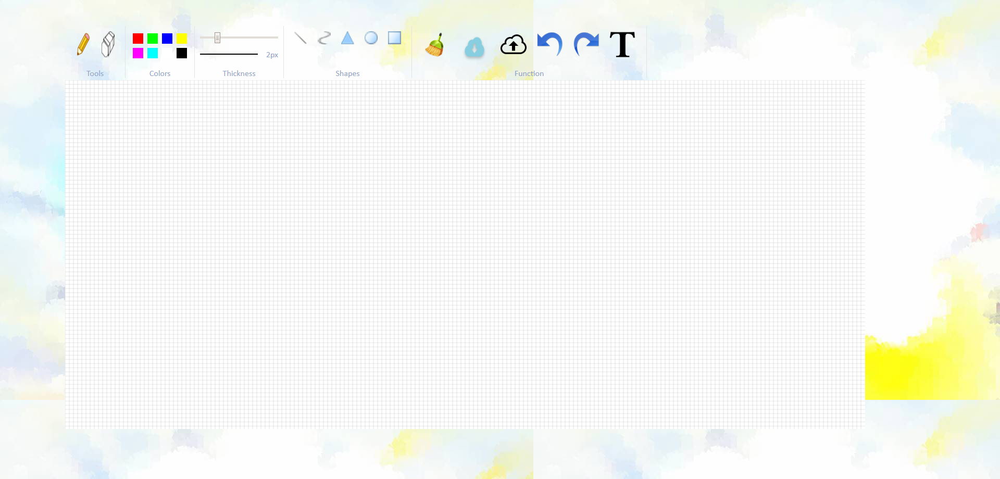

# Software Studio 2018 Spring Assignment 01 Web Canvas

## Web Canvas
URL:https://105062338.gitlab.io/AS_01_WebCanvas/
</img>

## Todo
1. **Fork the repo ,remove fork relationship and change project visibility to public.**
2. Create your own web page with HTML5 canvas element where we can draw somethings.
3. Beautify appearance (CSS).
4. Design user interaction widgets and control tools for custom setting or editing (JavaScript).
5. **Commit to "your" project repository and deploy to Gitlab page.**
6. **Describing the functions of your canvas in REABME.md**

## Scoring (Check detailed requirments via iLMS)

|                       **Item**                   | **Score** |
|:--------------------------------------------:|:-----:|
|               Basic components               |  60%  |
|                 Advance tools                |  35%  |
|            Appearance (subjective)           |   5%  |
| Other useful widgets (**describe on README.md**) | 1~10% |

## Reminder
* Do not make any change to our root project repository.
* Deploy your web page to Gitlab page, and ensure it works correctly.
    * **Your main page should be named as ```index.html```**
    * **URL should be : https://[studentID].gitlab.io/AS_01_WebCanvas**
* You should also upload all source code to iLMS.
    * .html or .htm, .css, .js, etc.
    * source files
* **Deadline: 2018/04/05 23:59 (commit time)**
    * Delay will get 0 point (no reason)
    * Copy will get 0 point
    * "屍體" and 404 is not allowed

---------------------------------------REPORT----------------------------------------------------

在這次的作業中，我主要分成canvas,tools,colors,thickness,shapes,functions，這六大類來實作，而這六大類也分別寫在index.html,setting.js,main.js,main.css當中。

------------------------------------------------------------------------------------------------------
首先，大概介紹一下六大類當中分別包含什麼項目。
1.canvas：在畫布中除了白底外，我還加了方格紙的效果，分別叫做canvas,canvasGrid。

2.tools：在tools裏有鉛筆與想皮擦。

3.colors：調色盤，有八種顏色可以選擇。

4.thickness：調整畫筆的粗細。

5.shapes：有5種選擇，分別是直線,曲線,圓形,方形,三角形。

6.functions：有六大功能，分別是清空,上傳,下載,redo,undo,打字。

------------------------------------------------------------------------------------------------------

接下來說明一下index.html,setting.js,main.js,main.css包含了哪些東西

---------index.html------------

在head中設定了utf-8以及連結main.css。

再來是body，body最主要的功能就是將所有東西畫在網頁上，先呼叫init()這個在setting.js中的function將畫布畫出來，再來是將tools,colors,thickness,shapes,functions這五大類裡的東西畫出來。

index.html的程式碼並不多，主要就是將所需要的東西聯結起來，並將所需要的東西畫在網頁上。


--------setting.js---------------
大致可分為10個function：
1.chooseTool：
    判斷現在選到的是tools裡的鉛筆或橡皮擦。
2.chooseShape：
    判斷現在選到的是shapes裡的哪個樣式，主要分成畫出圖型與線條兩類，若是選到圖形類的，就不會根據游標畫出線來，若是選到線條，則根據游標畫出線。
3.chooseColor,pickColor：
    根據游標點擊到的顏色去設定目前的畫筆。
4.changeThickness：
    最粗到最細分成10個等級，並將此設定套用到畫筆身上。
5.drawGrid：
    將線根據畫布的長寬,邊界畫到網頁上，呈現網格效果。
6.init：
    初始化畫布，例如addEventListener來判斷對畫布的點擊，clearRect設定畫布.....等，主要就是在設定畫布的大小和與外部動作連結的功能。
7.clearpad：
    功能是清空畫布，原本只有用clearRect，卻發現這樣並無法完整的清空，會有bug，後來加了.save,.transform,.restoro，在清空畫布前重置變換，這樣就能成功有效地清除畫布。
8.cPush,cUndo,cRedo：
    這是為了完成redo,undo所寫的三個function，主要實作理念是創造一個陣列，並將當前畫布的樣子存到陣列當中，然後在點擊undo或redo的時候往前或往後顯示畫布的樣子。用一個step記住目前是第幾次的動作，在push當中，每次都會在滑鼠放開的時候將當前畫布的樣子根據step放進陣列，並將step加一，之後在undo,redo中會根據step畫出應有的樣子。
9.text,addInput,handleEnter,drawText：
    這些是為了完成打字所寫的function，當點擊打字的圖示後，會根據之後滑鼠所點的地方出現一個輸入框，這個輸入框在輸入文字並按下enter後就會將剛才所打的字印在畫布上。
10.readImage,test1：
    這兩個是為了完成上傳圖片所寫的，可以從電腦選擇一張圖片並上傳，上傳後圖片將會直接整個顯示在畫布上。

-------------main.js----------------------
大致可分為
1.handleTooldown：
    這跟下面兩個function都是在使用tool(鉛筆,橡皮擦)的時候所會用到的function，這一個是當滑鼠按下去時會觸發的，他會判斷當前滑鼠所在的位置以及當前使用的畫筆顏色，若是橡皮擦則把當前位置的東西塗掉。
2.handleToolup：
    在滑鼠放開的時候會觸發。
3.handleToolmove：
    這是在滑鼠按下去並且移動時會觸發的，他會判斷游標是如何移動，並根據當前所選的畫筆顏色,粗細等等或橡皮擦，來對畫布做出畫畫或塗掉的動作。
4.RGBtoHex：
    將RGB三原色轉成十六進位。
5.isSameColor：
6.handleShapeDown：
    這跟下面兩個function都是在畫圖型時會用到的，並且與tool的概念是差不多的。
7.handleShapeUp：
    在這個function裡他會判斷是不是在畫多邊形或是曲線，兩者在判斷與做的事情上會有些許的不同，但其實主要都是把東西畫上去。
8.handleShapeMove：
   跟tool一樣，他會去判斷當前的游標位置，再將其轉為在畫布上的位置，比較特別的是他會判斷是不是在畫curve，若是curve的話會取中間的那一點來使其變彎。
   9.createshape：
    是根據handleShapedown來觸發的function，根據選到的shape來new出一個相對應的shape，去讓handleShapeDown可以順利產生圖形。

--------------main.css--------------------
在main.css中，最主要的目的就是設定網頁中各個東西的位置,大小,顏色....等，就是各個物件的attribute。


-------------結語---------------------------
    js和css和html對我來說是之前從未接觸過的語言，在此次實作的過程中，碰到許多語法和架構上的問題，與之前碰過的c c++幾乎不同，所以寫的有點辛苦，不過在上網查了很多資料與詢問同學後，雖然過程中真的還蠻辛苦的，但也因此學到了不少新的用法與技巧，瞬間覺得自己對這幾個新的語言有蠻大的進步，最後也成功完成了這次的網頁版小畫家。
